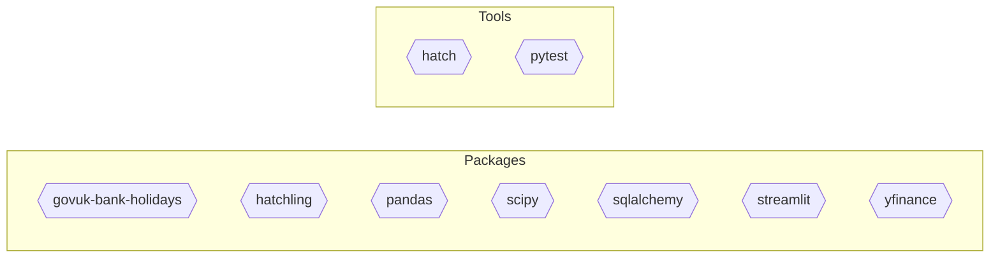

<!--
generated_by: repodocs/0.1.0
output_id: commands-md
output_purpose: workflow
primary_audience: operator
ownership_class: generated
engine_version: 0.1.0
renderer_version: commands-markdown-v1
last_run_id: dd8bc596-c35a-4962-b1bb-775fba14bbab
-->

# Commands Reference

This file groups grounded command facts by operational purpose and surfaces
primary commands first without expanding them into ungrounded operating guidance.

No commands were detected in current stored facts.

## Dependency Diagram

## Footer

Generated by repodocs.
