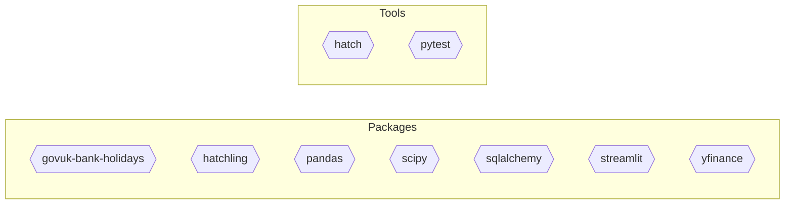

<!--
generated_by: repodocs/0.1.0
output_id: overview-md
output_purpose: overview
primary_audience: developer
ownership_class: generated
engine_version: 0.1.0
renderer_version: overview-markdown-v1
last_run_id: dd8bc596-c35a-4962-b1bb-775fba14bbab
-->

# Repository Overview

This file summarizes the repository from stored repodocs facts.

## Repository Summary

- Repository: `investment-optimiser`
- Classification: `library` (confidence: `high`)
- Selected profile: `library` (confidence: `high`)

## Primary Unit

- Name: `investment_optimiser`
- Type: `python_package`
- Root path: `src/investment_optimiser`
- Confidence: `high`

## Unit Details

### `investment_optimiser`

#### Dependencies

## Uncertainty

- Could not derive onboarding path for repo from current stored facts.
- Could not derive onboarding path for unit 'investment_optimiser' from current stored facts.

## Footer

Generated by repodocs.
